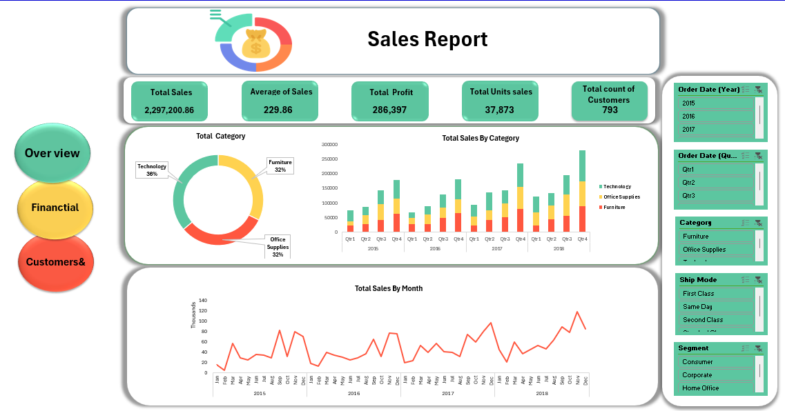
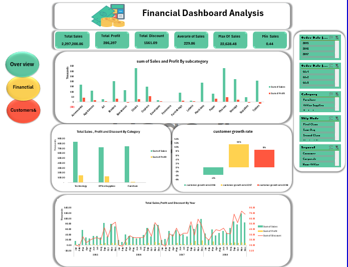
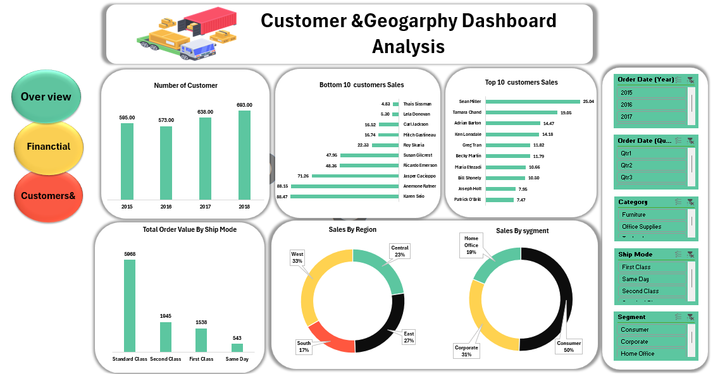

# 📊 Sales Report Data Analysis

## 📖 Project Overview
This project provides an in-depth analysis of sales data using Excel. The report focuses on key financial performance metrics, customer demographics, and geographical distribution of sales. The data is broken down into the following sections:

1. **📝 Overview**: General summary of the sales data.
2. **💵 Financial**: Detailed financial breakdown of sales and revenue.
3. **🌍 Customers & Geography**: Insights into customer demographics and geographical sales distribution.

## 📁 Project Structure
The Excel workbook contains the following tabs:

### 1. 📝 Overview
This tab provides a high-level summary of sales performance, including total revenue, number of customers, and key metrics for the reporting period.

---

### 2. 💵 Financial
The financial tab delves into the sales figures, revenue, and profitability analysis. Key metrics such as gross profit, net income, and expenses are analyzed.

---

### 3. 🌍 Customers & Geography
This tab highlights customer data and sales distribution across different geographical locations. It explores customer segmentation, region-specific performance, and trends.

---
## 📁 Dataset
Description about dataset used

## ✨ Key Features of the Analysis

- **🔍 Data Cleaning**: The raw sales data was cleaned and formatted in Excel to ensure accuracy and consistency.
- **📊 Visualization**: Charts and graphs were created to visualize sales trends, customer demographics, and regional sales distribution.
- **📈 Pivot Tables**: Used to summarize and group data for better insights into the financial performance and customer breakdown.
- **💡 Financial Metrics**: Calculations of key metrics like total revenue, gross margin, and net profit to understand the company's profitability.
- **🌍 Geographical Insights**: Analysis of sales performance across different regions to identify high-performing and underperforming areas.

## 🛠 Tools Used

- **Excel**: The main tool used for data cleaning, analysis, and visualization. Features like pivot tables, charts, and formulas were employed for insightful reporting.
- **Power Query**: For data transformation and preparation.
- **Data Visualization**: Charts, graphs, and conditional formatting were used to make the data easy to interpret.

## 🚀 Getting Started

To replicate the analysis:

1. Download the Excel workbook from this repository.
2. Open the workbook in Excel and navigate through the tabs for detailed insights.
3. Adjust the data range if new data is added for future analysis.

